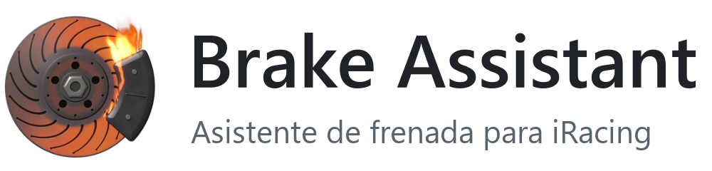
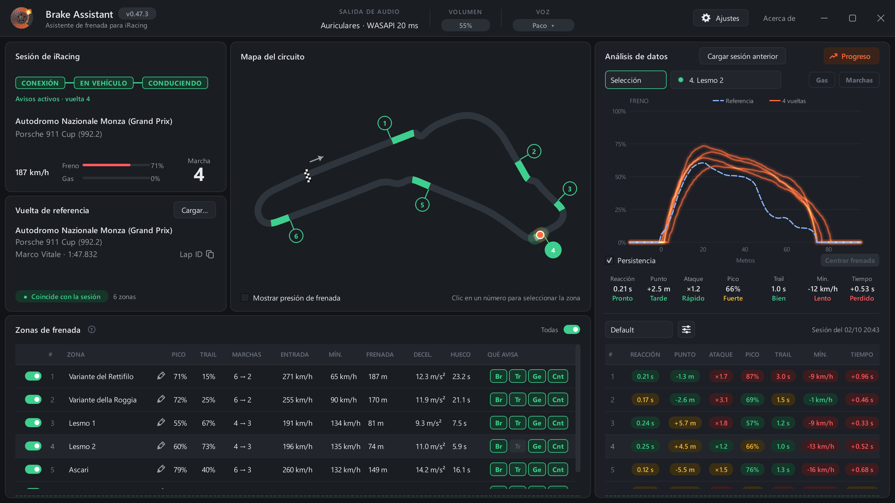
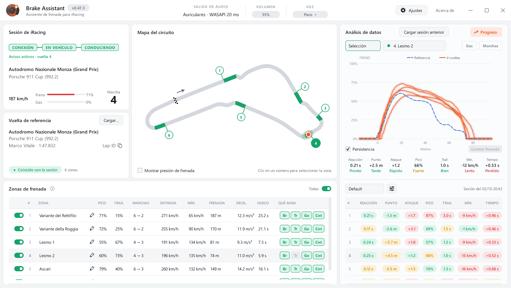
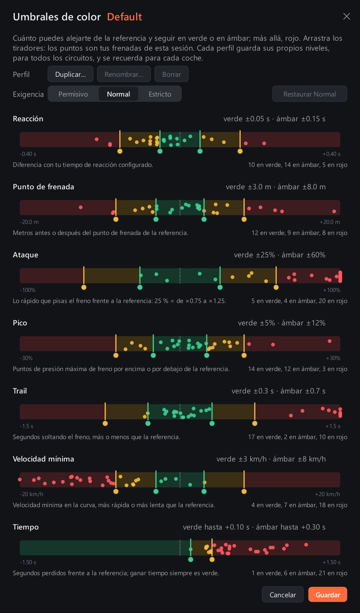
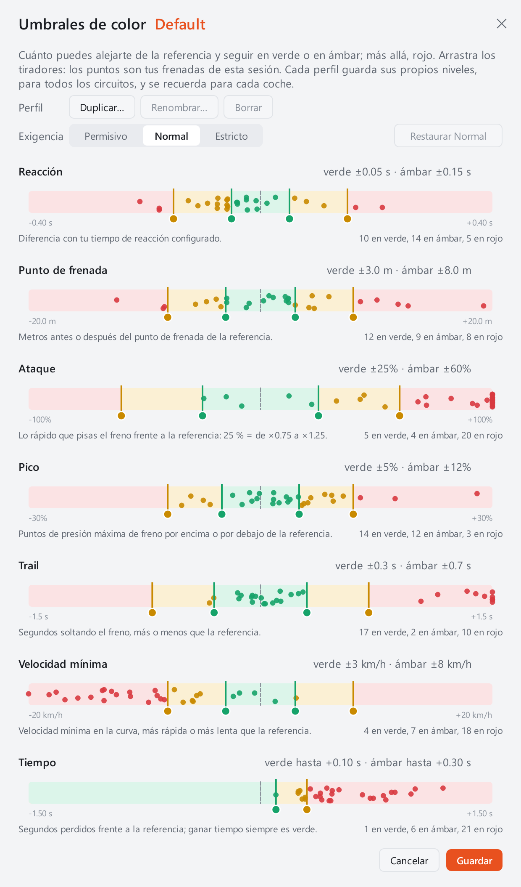
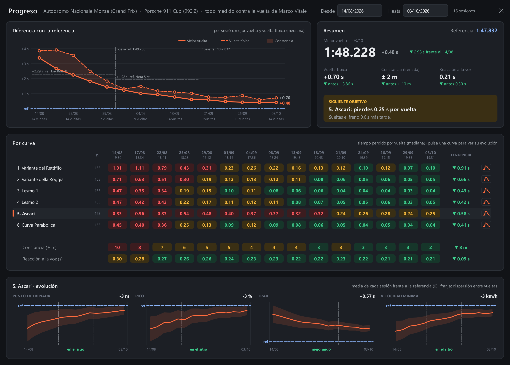
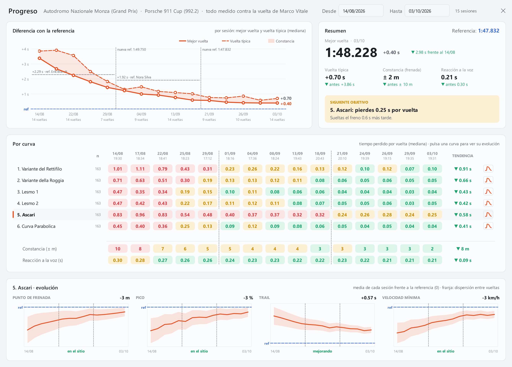

[English](README.md) | **Español**

<h1>
  <picture>
    <source media="(prefers-color-scheme: dark)" srcset="docs/es/header_dark.png">
    
  </picture>
</h1>

Brake Assistant es un asistente de frenada para iRacing. Compara la vuelta
en curso con una vuelta de referencia de Garage 61, avisa por voz antes de
cada frenada (con una cuenta atrás que termina en el punto de frenada) y,
al terminar, analiza cada frenada en comparación con la referencia.

La herramienta está concebida únicamente para el aprendizaje y el
perfeccionamiento de las frenadas.

  
  

**[Descargar la última versión](https://github.com/AirmakZ/brake_assistant/releases)** ·
**[Documentación (wiki, en inglés)](https://github.com/AirmakZ/brake_assistant/wiki)**

Las betas se publican como *Pre-release* en la
[página de versiones](https://github.com/AirmakZ/brake_assistant/releases)
y caducan a los 30 días.

---

## Funciones

- **Avisos por voz en cada frenada.** Antes de cada zona, el asistente
  indica la intensidad de la frenada, el trail braking y la marcha, y
  emite una cuenta atrás («3, 2, 1, ya») que termina en el punto de frenada
  de la referencia. El momento del aviso se ajusta a la velocidad del
  coche, al tiempo de reacción del piloto y al retardo del equipo de audio.
- **Avisos configurables.** Cada zona puede activarse o desactivarse, y se
  elige qué incluye cada aviso. Cuando dos curvas están demasiado próximas
  para el aviso completo, se omite la parte que no cabe.
- **Análisis de cada frenada.** Punto de frenada, ataque, presión máxima,
  trail, velocidad mínima, tiempo de reacción y tiempo ganado o perdido,
  con una gráfica de freno, acelerador y marchas superpuesta a la de la
  referencia. Los umbrales de color (verde, ámbar y rojo) son ajustables.

  
  

- **Evolución entre sesiones.** La ventana «Progreso» compara las sesiones
  con el mismo coche y circuito: curva en la que más tiempo se pierde y
  motivo, constancia y tendencia.

  
  

- **Mapa del circuito** con las zonas de frenada y la posición del coche.
- **Nombres de curva** para cada zona, modificables.
- **Atajos de volumen** en una tecla o un botón del volante, sin
  interferir con los controles de iRacing.
- **Interfaz en español e inglés**, con tema claro y oscuro, y voces en
  ambos idiomas.

## Requisitos

- Windows 10 u 11 de 64 bits.
- iRacing.
- Una cuenta de [Garage 61](https://garage61.net) (gratuita) para descargar
  las vueltas de referencia. El programa no incluye ninguna.
- Auriculares o altavoces con cable. Los dispositivos Bluetooth tienen un
  retardo demasiado alto para que el aviso llegue a tiempo.

## Instalación

1. Descargar `BrakeAssistant-Setup-<versión>.exe` desde la
   [página de versiones](https://github.com/AirmakZ/brake_assistant/releases).
2. Ejecutar el instalador. Al no estar firmado digitalmente, Windows puede
   mostrar el aviso **«Windows protegió su PC»** con **«Editor
   desconocido»**. Para continuar, pulsar **«Más información»** y después
   **«Ejecutar de todas formas»**.
3. Aceptar la licencia y completar los pasos. La instalación se realiza
   solo para el usuario actual y no requiere permisos de administrador.

Las versiones nuevas se ofrecen al arrancar y se instalan solas, sin tocar
los datos. Más detalles en
[Installation](https://github.com/AirmakZ/brake_assistant/wiki/Installation)
y [Updates](https://github.com/AirmakZ/brake_assistant/wiki/Updates).

## Primeros pasos

1. En [garage61.net](https://garage61.net), exportar una vuelta con el
   mismo coche y circuito con **«Export to CSV»** (sin renombrar el
   archivo) y cargarla con **«Cargar…»** en la tarjeta **Vuelta de
   referencia**.
2. En **Ajustes > Básico**, elegir la salida de audio y la voz, y calibrar
   el tiempo de reacción (recomendado).
3. Entrar en una sesión de práctica de iRacing con el programa en modo
   **Live**. Al oír «El pit está abierto. Puedes salir», salir a pista:
   pasada la vuelta de salida, cada frenada tiene su aviso.
4. De vuelta en boxes, revisar cada frenada en **«Análisis de datos»** y la
   evolución en **«Progreso»**.

En el primer arranque, un tutorial presenta cada parte de la ventana. La
guía paso a paso completa está en
[Quick start](https://github.com/AirmakZ/brake_assistant/wiki/Quick-Start).

## Documentación

La [wiki](https://github.com/AirmakZ/brake_assistant/wiki) (en inglés)
explica cada parte del programa: cómo funcionan los avisos, cómo elegir una
buena vuelta de referencia, el análisis, los ajustes, las voces
personalizadas, dónde se guardan los datos y la solución de problemas.

## Informar de un problema

En el programa, abrir **«Acerca de»** y pulsar **«Informar de un
problema…»**. Prepara lo necesario para un problema de la aplicación o con
un aviso o una frenada en un circuito, y abre el formulario
correspondiente en GitHub. Las sugerencias también son bienvenidas como
[incidencias](https://github.com/AirmakZ/brake_assistant/issues).

## Uso responsable

Brake Assistant es una herramienta de entrenamiento para **sesiones de
práctica**, no una ayuda en carrera. Corresponde al piloto cumplir las
normas de iRacing y de las competiciones en las que participe.

## Licencia

Brake Assistant es **gratuito** para uso personal. También puede utilizarse
en clases o sesiones de coaching de pago, siempre que se informe a los
alumnos de que el programa es gratuito y de dónde puede descargarse. No se
permite su venta ni su redistribución. Las condiciones completas figuran en
[LICENSE](LICENSE) (en inglés, versión de referencia) y
[LICENSE.es](LICENSE.es) (traducción al español).

El programa incluye componentes de terceros con sus propias licencias (Qt,
Python, NumPy, PortAudio, entre otros); la lista y los textos completos se
encuentran en la carpeta `licenses` de la instalación.

iRacing es una marca registrada de iRacing.com Motorsport Simulations, LLC.
Garage 61 y su logotipo pertenecen a sus respectivos propietarios. Brake
Assistant es un proyecto independiente, sin afiliación, patrocinio ni aval
de ninguno de ellos.
