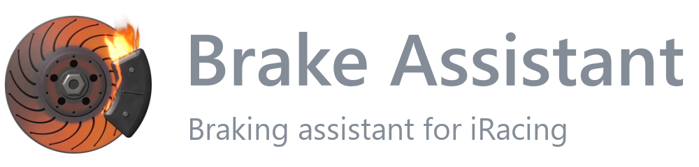
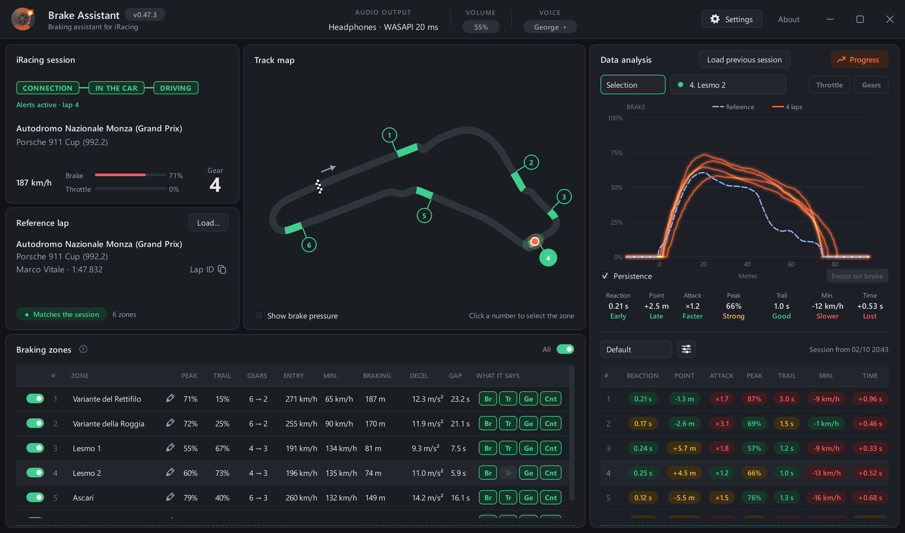
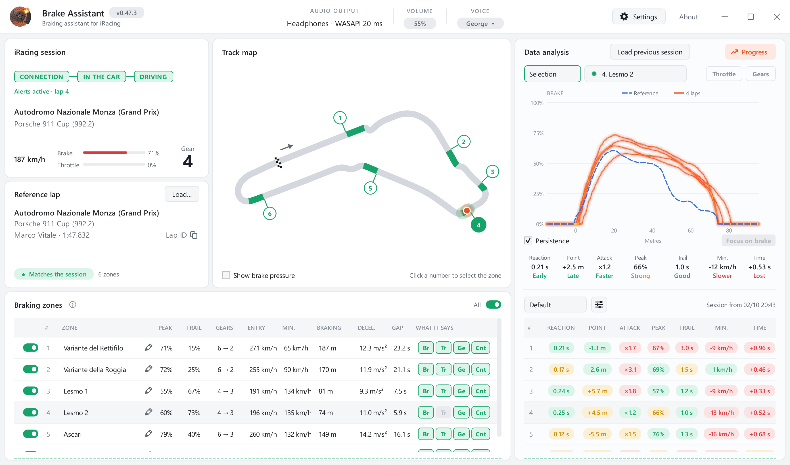
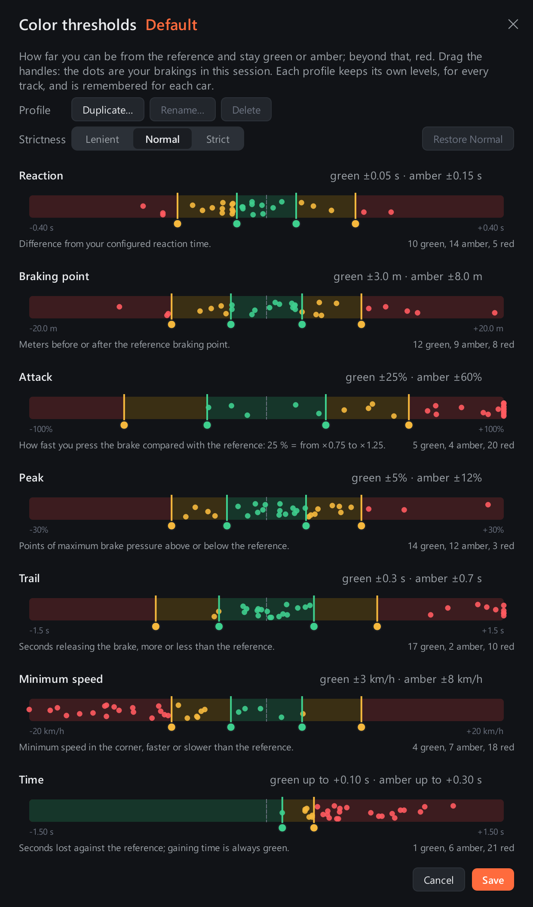
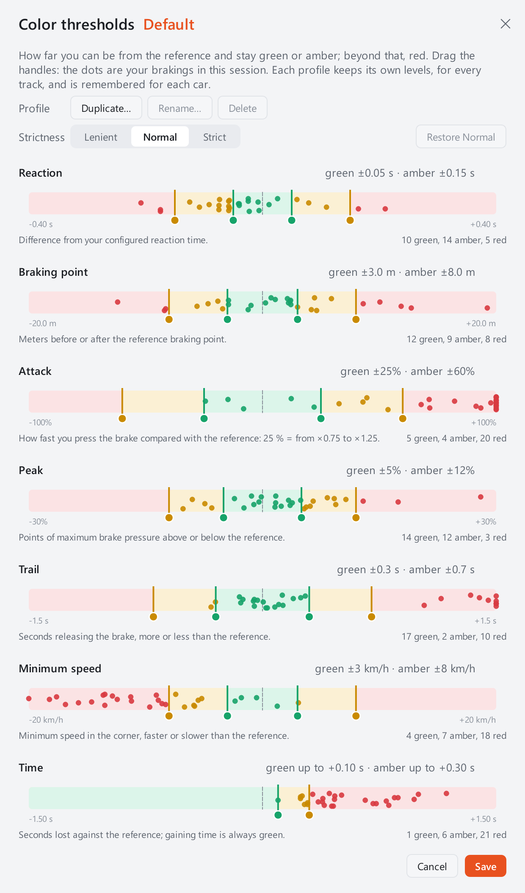
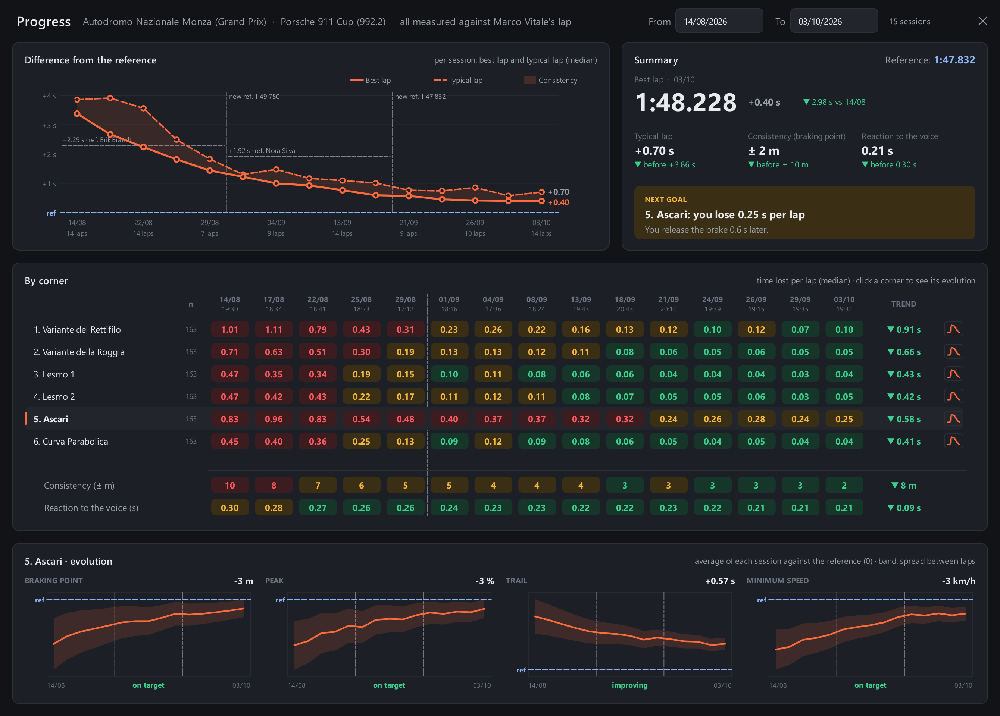
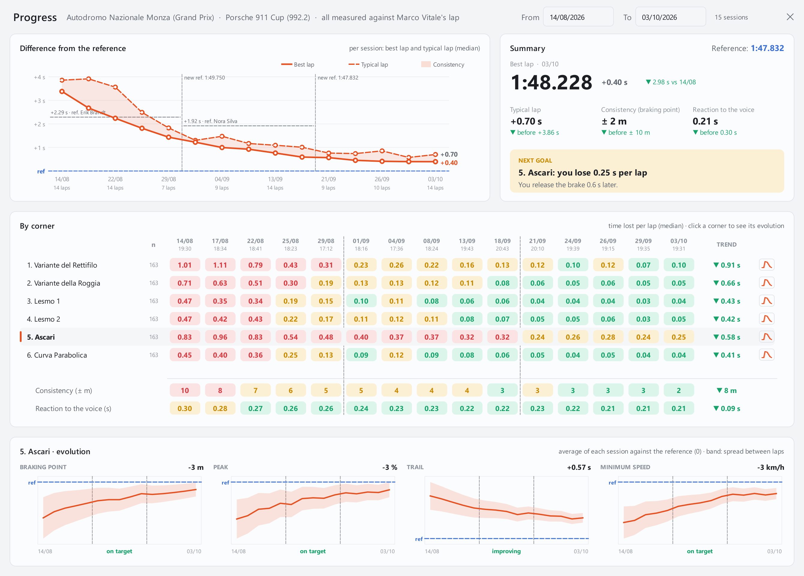

**English** | [Español](README.es.md)

<h1>
  
</h1>

Brake Assistant is a braking assistant for iRacing. It compares the lap in
progress with a Garage 61 reference lap, gives a voice alert before each
braking zone (with a countdown that ends at the braking point) and, once
you finish, analyzes each braking against the reference.

The tool is intended solely for learning and refining your braking.

  
  

**[Download the latest version](https://github.com/AirmakZ/brake_assistant/releases)** ·
**[Documentation (wiki)](https://github.com/AirmakZ/brake_assistant/wiki)**

Betas are published as *Pre-release* on the
[releases page](https://github.com/AirmakZ/brake_assistant/releases) and
expire after 30 days.

---

## Features

- **Voice alerts for every braking zone.** Before each zone, the assistant
  announces the braking intensity, the trail braking and the gear,
  followed by a countdown ("3, 2, 1, brake") that ends at the reference
  braking point. The timing adapts to the car's speed, your reaction time
  and the latency of your audio device.
- **Configurable alerts.** Each zone can be turned on or off, and you
  choose what each alert includes. When two corners are too close for the
  full alert, the part that does not fit is skipped.
- **Analysis of every braking.** Braking point, attack, peak pressure,
  trail, minimum speed, reaction time and time gained or lost, with a
  brake, throttle and gear chart overlaid on the reference. The color
  thresholds (green, amber and red) are adjustable.

  
  

- **Progress across sessions.** The "Progress" window compares the
  sessions with the same car and track: the corner where you lose the most
  time and why, consistency and trend.

  
  

- **Track map** with the braking zones and the car's position.
- **Corner names** for each zone, editable.
- **Volume shortcuts** on a key or a wheel button, without interfering
  with the iRacing controls.
- **Interface in English and Spanish**, with light and dark themes, and
  voices in both languages.

## Requirements

- Windows 10 or 11, 64-bit.
- iRacing.
- A [Garage 61](https://garage61.net) account (free) to download the
  reference laps. The program does not include any.
- Wired headphones or speakers. Bluetooth devices have too much latency for
  the alert to arrive on time.

## Installation

1. Download `BrakeAssistant-Setup-<version>.exe` from the
   [releases page](https://github.com/AirmakZ/brake_assistant/releases).
2. Run the installer. As it is not digitally signed, Windows may show the
   **"Windows protected your PC"** warning with **"Unknown publisher"**. To
   continue, click **"More info"** and then **"Run anyway"**.
3. Accept the licence and complete the steps. The installation is for the
   current user only and does not require administrator rights.

New versions are offered at startup and install themselves, without
touching your data. See [Installation](https://github.com/AirmakZ/brake_assistant/wiki/Installation)
and [Updates](https://github.com/AirmakZ/brake_assistant/wiki/Updates).

## Getting started

1. On [garage61.net](https://garage61.net), export a lap with the same car
   and track with **"Export to CSV"** (do not rename the file), and load it
   with **"Load…"** on the **Reference lap** card.
2. In **Settings > Basic**, choose your audio output and voice, and
   calibrate your reaction time (recommended).
3. Join an iRacing practice session with the program in **Live** mode. When
   you hear "Pit exit is green. You're clear to go", drive out: after the
   out lap, every braking zone has its alert.
4. Back in the pits, review each braking in **"Data analysis"** and your
   evolution in **"Progress"**.

On first launch, a tutorial introduces each part of the window. The full
step-by-step guide is in
[Quick start](https://github.com/AirmakZ/brake_assistant/wiki/Quick-Start).

## Documentation

The [wiki](https://github.com/AirmakZ/brake_assistant/wiki) explains every
part of the program: how the alerts work, choosing a good reference lap,
the analysis, the settings, custom voices, where your data is stored and
troubleshooting.

## Reporting a problem

In the program, open **"About"** and click **"Report a problem…"**. It
prepares what is needed for an application problem or for a problem with an
alert or a braking on a track, and opens the matching form on GitHub.
Suggestions are also welcome as
[issues](https://github.com/AirmakZ/brake_assistant/issues).

## Fair use

Brake Assistant is a training tool for **practice sessions**, not an
in-race aid. It is up to the driver to follow the rules of iRacing and of
the competitions they take part in.

## Licence

Brake Assistant is **free** for personal use. It may also be used in paid
classes or coaching sessions, as long as the students are told that the
program is free and where it can be downloaded. Selling or redistributing
it is not allowed. The full terms are in [LICENSE](LICENSE) (English, the
reference version) and [LICENSE.es](LICENSE.es) (Spanish translation).

The program includes third-party components under their own licences (Qt,
Python, NumPy, PortAudio, among others); the list and full texts are in
the `licenses` folder of the installation.

iRacing is a registered trademark of iRacing.com Motorsport Simulations,
LLC. Garage 61 and its logo belong to their respective owners. Brake
Assistant is an independent project, not affiliated with, sponsored by or
endorsed by any of them.
